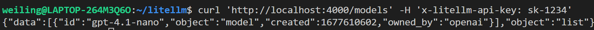
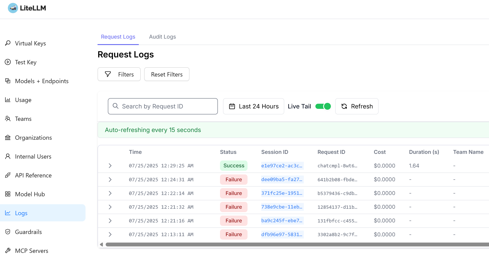
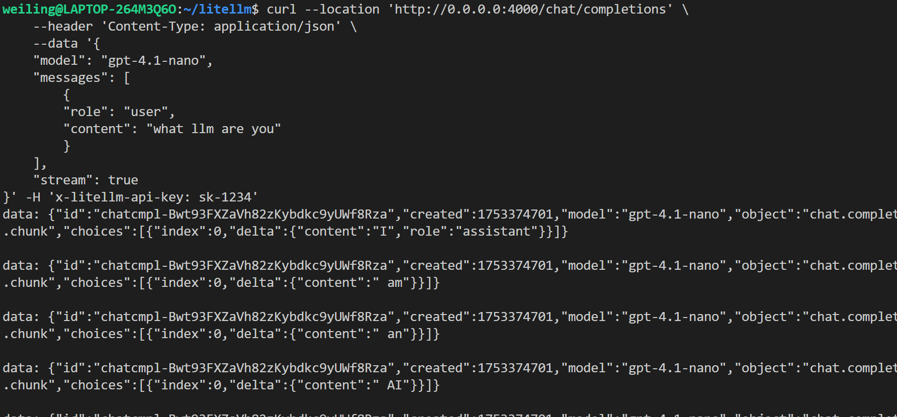

```
詳細資訊在這裡喔
可以複製code喔
但這段在hackmd無法複製喔
```


Here is a footnote reference,[^1][^2] and another.[^longnote]

[^1]: Here is the footnote.
[^2]: Here is the footnote.
[^longnote]: Here's one with multiple blocks.
    Subsequent paragraphs are indented to show that they
belong to the previous footnote.


## LiteLLM

git clone https://github.com/BerriAI/litellm
cd litellm
echo 'LITELLM_MASTER_KEY="sk-1234"' > .env
echo 'LITELLM_SALT_KEY="sk-1234"' >> .env
source .env
docker-compose up

browser(ui): http://localhost:4000/ui (login: admin/sk-1234)
browser(swagger): http://localhost:4000/ (login: sk-1234)

從UI上新增model
用API測試列出所有model
curl 'http://localhost:4000/models' -H 'x-litellm-api-key: sk-1234'


```
curl --location 'http://0.0.0.0:4000/chat/completions' \
    --header 'Content-Type: application/json' \
    --data '{
    "model": "gpt-4.1-nano",
    "messages": [
        {
        "role": "user",
        "content": "what llm are you"
        }
    ]
}' -H 'x-litellm-api-key: sk-1234'
```



streaming
```
curl --location 'http://0.0.0.0:4000/chat/completions' \
    --header 'Content-Type: application/json' \
    --data '{
    "model": "gpt-4.1-nano",
    "messages": [
        {
        "role": "user",
        "content": "what llm are you"
        }
    ],
    "stream": true
}' -H 'x-litellm-api-key: sk-1234'
```



batch with multi models
```
curl --location 'http://localhost:4000/chat/completions' \
    --header 'Authorization: Bearer sk-1234' \
    --header 'Content-Type: application/json' \
    --data '{
    "model": "gpt-4.1-nano,gpt-4.1-mini",
    "max_tokens": 10,
    "user": "litellm2",
    "messages": [
        {
        "role": "user",
        "content": "hello"
        }
    ]
}'
```


create a batch file: https://docs.litellm.ai/docs/proxy/managed_batches